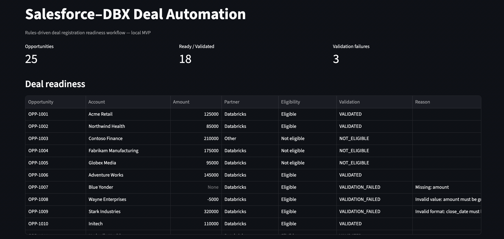
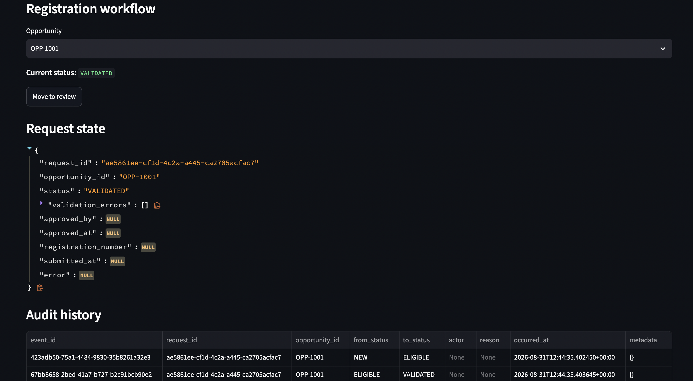

# Salesforce → Databricks Deal Automation

[](https://github.com/abhi9265/Salesforce-DBX-deal-automation/actions/workflows/ci.yml) [](benchmarks/)

> **Enterprise data-integration portfolio project:** automate Salesforce deal-registration readiness with deterministic validation, human approval, idempotent submission, durable audit history and a Databricks-facing adapter boundary.
>
> **Topics:** `Python` · `Streamlit` · `Salesforce` · `Databricks` · `Data Engineering` · `Workflow Automation` · `Idempotency` · `System Design`

A production-minded local MVP for automating a common enterprise workflow: evaluate Salesforce opportunities, validate registration readiness, route requests through human approval, submit to a Databricks-facing adapter, prevent duplicate submissions, and retain an auditable lifecycle.

> **Scope:** this repository intentionally implements the workflow end to end with synthetic Salesforce-shaped data, a mock Databricks registration adapter, SQLite persistence, deterministic business rules, and automated tests. Real Salesforce credentials and a production Databricks registration contract are adapter boundaries and are **not** claimed as implemented.

## Application Preview

The screenshots below are from the **actual Streamlit MVP running locally from this repository**.

### Deal Readiness



*Live local execution — opportunity inventory, readiness/validation results and deal-level review data.*

### Registration Workflow & Audit



*Live local execution — request state, workflow identity, validation/approval status and persisted audit history.*

> **Run it yourself:** `streamlit run app.py` — the MVP uses synthetic data and local persistence; no production Salesforce or Databricks credentials are required.

## Why this project exists

Deal registration is rarely just an API call. A reliable implementation has to answer:

- Which Salesforce opportunities changed since the last successful sync?
- Is this opportunity eligible for registration?
- Is the data complete enough to submit?
- Has a human approved the request?
- Could the same source version arrive twice?
- What happened if the downstream system rejected or did not confirm the request?
- Can an operator reconstruct the lifecycle later?

This project makes those decisions explicit and testable.

## Architecture

```text
                 Salesforce / Synthetic Source
                              │
                              ▼
                    Incremental Sync Contract
                     (LastModifiedDate watermark)
                              │
                              ▼
                       Canonical Deal
                              │
                    ┌─────────┴─────────┐
                    ▼                   ▼
              Eligibility          Validation
                    │                   │
                    └─────────┬─────────┘
                              ▼
                    Registration Request
                              │
                              ▼
                     Approval State Machine
                              │
                           APPROVED
                              │
                              ▼
                       Idempotency Check
                              │
                              ▼
                       Field Mapping
                              │
                              ▼
                 Databricks Registration Adapter
                              │
                    ┌─────────┴─────────┐
                    ▼                   ▼
                Accepted            Rejected
                    │                   │
                    ▼                   ▼
                SUBMITTED        SUBMISSION_FAILED
                    │
              confirmation received
                    │
                    ▼
                REGISTERED
                    │
                    └──────────────┐
                                   ▼
                         SQLite Request State
                         + Immutable Event Log
```

## Lifecycle

The authoritative workflow is deterministic:

```text
NEW
 ↓
ELIGIBLE
 ↓
VALIDATED
 ↓
READY_FOR_REVIEW
 ↓
APPROVED
 ↓
SUBMITTED
 ↓
REGISTERED
```

Exception states are explicit: `NOT_ELIGIBLE`, `VALIDATION_FAILED`, `REJECTED`, `SUBMISSION_FAILED`, and `SUBMISSION_UNKNOWN`.

A request cannot be submitted without approval, and a request cannot become `REGISTERED` without a downstream registration number.

## Engineering capabilities

### Data Engineering

- Salesforce-shaped source adapter
- Incremental processing using source update timestamps
- Successful-sync watermark semantics
- Canonical domain model
- Deterministic eligibility and validation
- Explicit source-to-target field mapping
- Durable idempotency using business-version fingerprints

### Reliability

- Duplicate delivery protection
- Explicit downstream failure/unknown states
- Stable request UUIDs for submission identity
- Durable SQLite request state
- Append-only lifecycle events
- Request state and event history can be reconstructed independently

### Software Engineering

- Domain logic separated from integration adapters
- Protocol-based integration boundaries
- Unit + integration + end-to-end tests
- GitHub Actions CI and benchmark workflows
- Deterministic Python packaging
- Synthetic fixtures only
- No production credentials or undocumented external contracts

## Repository structure

```text
.
├── adapters/
│   ├── salesforce/       Salesforce source boundary + local mock
│   └── databricks/       Registration boundary + local/HTTP adapters
├── audit/                Durable request state + immutable events + sync state
├── config/               Integration/configuration boundaries
├── data/                 Synthetic Salesforce opportunity fixtures
├── docs/                 Architecture, contracts, persistence and integration notes
├── domain/               Deal/request models, states and domain exceptions
├── services/             Sync, validation, mapping and registration orchestration
├── tests/                Unit, integration and end-to-end tests
├── benchmarks/           Reproducible benchmark methodology and results
├── app.py                Streamlit local MVP
├── pyproject.toml        Packaging, dependencies and pytest configuration
└── .github/workflows/    CI and benchmark automation
```

## Local quick start

### 1. Create the environment

```bash
python -m venv .venv
source .venv/bin/activate
```

Windows PowerShell:

```powershell
.venv\Scripts\Activate.ps1
```

### 2. Install the project

```bash
python -m pip install --upgrade pip
pip install -e '.[test]'
```

### 3. Run the tests

```bash
pytest
```

### 4. Run the local workflow UI

```bash
streamlit run app.py
```

The application uses synthetic data and local persistence. No Salesforce or Databricks credentials are required for the MVP.

See [`docs/DEMO.md`](docs/DEMO.md) for the short end-to-end workflow walkthrough.

## Benchmark Evidence

The repository includes a reproducible benchmark workflow executed by GitHub Actions. Benchmark results are generated from actual workflow runs rather than manually entered performance claims.

The benchmark measures executable workflow/test behavior on the GitHub-hosted runner and is intended as **reproducibility and regression evidence**, not a production-capacity guarantee.

See [`benchmarks/`](benchmarks/) and the GitHub Actions workflow for methodology and the latest published result.

## CI/CD

Every push to `main` or a feature branch is tested, and pull requests are validated regardless of their target branch.

CI performs:

1. Python 3.11 setup
2. Dependency installation from `pyproject.toml`
3. Editable package installation
4. Ruff quality checks
5. Full pytest execution

The CI workflow is intentionally small: the merge gate should prove that the repository can install, lint and test cleanly before additional deployment automation is introduced.

## External integration boundary

```text
Current MVP
CSV fixture
   ↓
Salesforce adapter
   ↓
Workflow engine
   ↓
Mock Databricks adapter
   ↓
SQLite audit/persistence

Production target
Salesforce Sandbox / API
   ↓
Same workflow engine
   ↓
Authorized Databricks registration interface
```

The production adapters should be implemented only after the real authentication model and downstream contract are confirmed. This avoids building a fake integration that looks impressive but is not deployable.

## Design decisions

### Rules decide; AI may explain

Eligibility, validation, state transitions and submission confirmation are deterministic. Any future AI layer should assist with policy extraction, explanation, or operator guidance—not silently override business rules.

### Integrations stay at the edge

The domain model does not know whether Salesforce is accessed through a REST API, Bulk API, or local fixture. The workflow does not know whether Databricks registration is HTTP, a service, or a future approved interface.

### Idempotency is based on business state

A source opportunity can be delivered repeatedly. The processor fingerprints the business fields that drive registration and persists successful processing, so replaying the same version does not create another submission.

### Unknown is not success

A downstream timeout or ambiguous response is represented explicitly. The workflow never marks a request registered without confirmation.

### Keep the architecture proportional

This project deliberately does **not** introduce Bronze/Silver/Gold, streaming infrastructure, orchestration platforms, or unnecessary cloud components. The problem being solved is workflow automation and reliable system integration; the architecture stays focused on that problem.

## What is intentionally not implemented

- Real Salesforce authentication/production extraction
- Production Databricks registration API contract
- Production secrets management
- Role-based enterprise identity/SSO
- Operational monitoring/SLA dashboards
- AI policy extraction or LLM-assisted explanations

These are clear extension points rather than hidden gaps.

## Interview discussion points

This project demonstrates practical topics worth discussing in a Data Engineering interview:

- Incremental extraction and watermark correctness
- Idempotency and replay safety
- Canonical data models
- Contract-driven adapters
- State-machine design
- Human-in-the-loop workflows
- Failure versus unknown downstream outcomes
- Durable auditability
- Test strategy and CI
- Keeping architecture simple when requirements do not justify a lakehouse layer

## Data safety

Only synthetic/sample data belongs in this repository. Never commit Salesforce credentials, security tokens, access tokens, production exports, or real customer/deal information.
